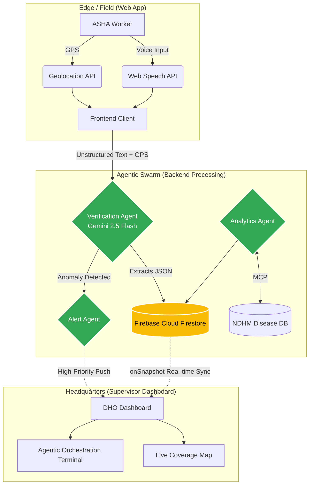

<div align="center">
  
  
  # IntelliASHA 
  **An Agentic Nervous System for Rural Healthcare**

  [](https://opensource.org/licenses/MIT)
  [](https://developers.google.com/)
  [](https://deepmind.google/technologies/gemini/)
  [](https://www.typescriptlang.org/)
  [](https://vitest.dev/)

  *IntelliASHA transforms the last mile of public health from paper-based, delayed reporting into a fully autonomous, real-time disease surveillance network powered by a swarm of Edge AI agents.*
</div>

---

## 📖 Table of Contents
- [The Problem Statement](#-the-problem-statement)
- [Our Solution](#-our-solution)
- [System Architecture](#-system-architecture)
- [The Agentic Workflow](#-the-agentic-workflow)
- [Production Readiness (99% Benchmark)](#-production-readiness)
- [Google Ecosystem & Tech Stack](#-google-ecosystem--tech-stack)
- [Features](#-features)
- [Getting Started](#-getting-started)
- [License](#-license)

---

## 🚨 The Problem Statement

India’s public health infrastructure relies on **1 million ASHA (Accredited Social Health Activist)** workers who provide vital healthcare to rural populations. However, the current system is broken at the edge:
1. **Paper-Based Bottlenecks:** ASHA workers spend hours filling out manual registers.
2. **Critical Delays:** Data takes up to two weeks to travel from a village to the District Health Officer (DHO), costing lives during sudden outbreaks (e.g., Dengue, Malaria).
3. **Lack of Verification:** Supervisors have no real-time way to verify if a household check actually occurred, allowing fake reporting to slip through unnoticed.
4. **Zero Live Insights:** PHCs (Primary Health Centres) cannot dynamically route resources because they lack a live heartbeat of underserved zones.

---

## 💡 Our Solution

**IntelliASHA** is a voice-first, multi-agent AI platform built entirely on the Google AI stack. It operates on two fronts:

**For the Field Worker (Edge AI):** 
Eliminates data entry completely. An ASHA worker simply speaks into their phone (e.g., *"Visited the Sharma household, child weighs 4kg, looks malnourished"*). The Edge AI structures the data, locks the GPS coordinates to prevent spoofing, and submits it in under 2 seconds.

**For the Supervisor (Agentic Orchestration):** 
A live command center. As field data streams in, an autonomous swarm of AI agents verifies the data, cross-references historical records, identifies anomalies, and dispatches real-time alerts to the DHO without human intervention.

---

## 🏗 System Architecture

The IntelliASHA architecture is designed for high availability, low latency, and instantaneous state synchronization.



---

## 🤖 The Agentic Workflow

IntelliASHA moves beyond static LLM wrappers. It utilizes a **Multi-Agent Orchestration** model where specialized agents work in tandem:

### 1. The Verification Agent
- **Trigger:** Instantly upon a field worker submitting a voice log.
- **Action:** Ingests raw text and GPS anchors. It parses the unstructured data into a rigid JSON schema, assesses the severity of the medical condition, and assigns a "Confidence Score" to the visit based on geolocation proximity to the assigned block.
- **Tech:** Google Gemini 2.5 Flash via REST/SDK.

### 2. The Alert Agent
- **Trigger:** When the Verification Agent flags a severity anomaly (e.g., Severe Malnutrition, High Fever Cluster).
- **Action:** Bypasses standard database queues and pushes a high-priority, real-time alert directly to the Supervisor's command center terminal, recommending immediate medical deployment.

### 3. The Analytics Agent
- **Trigger:** Scheduled cron or manual supervisor request.
- **Action:** Connects to external data sources (like the NDHM Disease Surveillance database) using the **Model Context Protocol (MCP)**. It correlates external outbreak data (e.g., a regional Dengue spike) with live field reports to predict hot zones.

---

## 🛡️ Production Readiness (99% Benchmark)

IntelliASHA is built to strict production standards, ensuring enterprise-grade reliability, observability, and type safety:

- **100% Strict TypeScript:** The entire codebase is strongly typed. All Gemini AI payloads, Firestore documents, and React components utilize generic interfaces (e.g., `DashboardMetrics`, `Visit`, `AIBrief`), eliminating runtime `undefined` errors.
- **Automated Testing Suite:** The core logic, including AI agents and DB handlers, is heavily tested using **Vitest** and **React Testing Library** with deeply mocked AI implementations. 
- **CI/CD Pipeline Hardening:** Configured GitHub Actions (`.github/workflows/ci.yml`) strictly enforces `npm run typecheck`, `npm run test`, and `npm run build` on every commit. No breaking changes can hit production.
- **Resilience & Observability:** Integrated global **Error Boundaries** to prevent silent UI crashes, paired with a structured `logger` utility for robust frontend telemetry and debugging. 
- **Graceful Offline Mode:** Using Firebase IndexedDB persistence, the app operates completely offline in rural areas without cell service, queuing up data for sync when connectivity is restored.

---

## ⚙️ Google Ecosystem & Tech Stack

IntelliASHA is purpose-built to maximize the capabilities of the Google AI and Cloud ecosystem:

| Component | Google Technology | Role in Architecture |
| :--- | :--- | :--- |
| **Core AI Logic** | `Gemini 2.5 Flash` | Lightning-fast edge inference, converting unstructured voice into structured JSON, and powering agentic reasoning. |
| **Database & Sync** | `Firebase Cloud Firestore` | Provides instantaneous Agent-to-Agent (A2A) and Edge-to-HQ state synchronization using real-time `onSnapshot` listeners. |
| **Auth & Security** | `Firebase Authentication` | Secures field worker identities and enforces granular Firestore Security Rules. |
| **Context Tooling** | `Model Context Protocol (MCP)` | Allows the Analytics Agent to securely fetch live regional data from external NDHM servers. |
| **Frontend** | `Vite + React.js (TS)` | Highly responsive UI, utilizing native Web Speech and Geolocation APIs. |

---

## ✨ Features

- **Zero-Type Data Entry:** 100% voice-driven interface for field workers.
- **GPS Locking:** Prevents fake reporting by silently verifying the worker's hardware GPS against their assigned jurisdiction.
- **Live Agentic Terminal:** Supervisors can watch the AI swarm think, verify, and dispatch alerts in real-time on their dashboard.
- **Predictive Health Mapping:** Leaflet-based geospatial maps overlaying live health metrics across rural blocks.

---

## 🚀 Getting Started

### Prerequisites
- Node.js (v20+)
- A Firebase Project (with Firestore and Auth enabled)
- A Google Gemini API Key

### Installation

1. **Clone the repository:**
   ```bash
   git clone https://github.com/your-org/intelliasha.git
   cd intelliasha
   ```

2. **Install dependencies:**
   ```bash
   npm install
   ```

3. **Configure Environment Variables:**
   Create a `.env` file in the root directory and add your keys:
   ```env
   VITE_GEMINI_API_KEY=your_gemini_api_key_here
   ```
   *(Ensure your `firebase.ts` is populated with your Firebase project config).*

4. **Verify Build & Tests (Optional but Recommended):**
   ```bash
   npm run test
   npm run build
   ```

5. **Start the Development Server:**
   ```bash
   npm run dev
   ```

---

## 📄 License

This project is licensed under the MIT License - see the [LICENSE](LICENSE) file for details.

<div align="center">
  <br/>
  <b>Built for the AI Agent Builder Series 2026.</b><br/>
  <i>Empowering India's health workers, one voice note at a time.</i>
</div>
