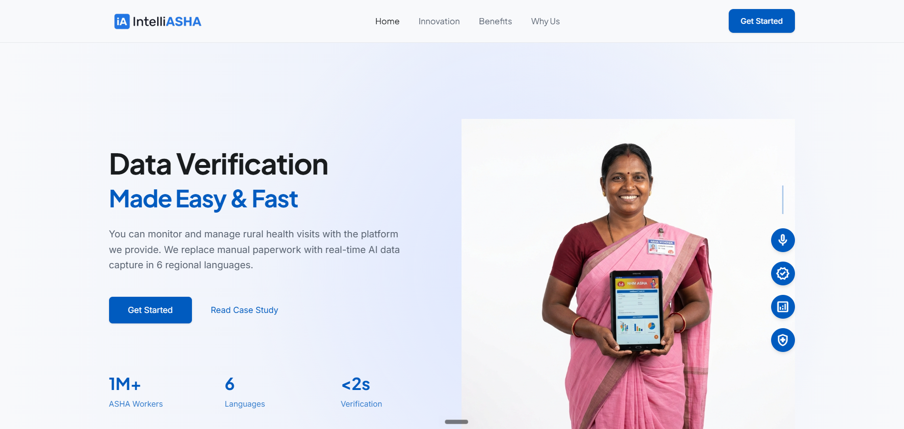
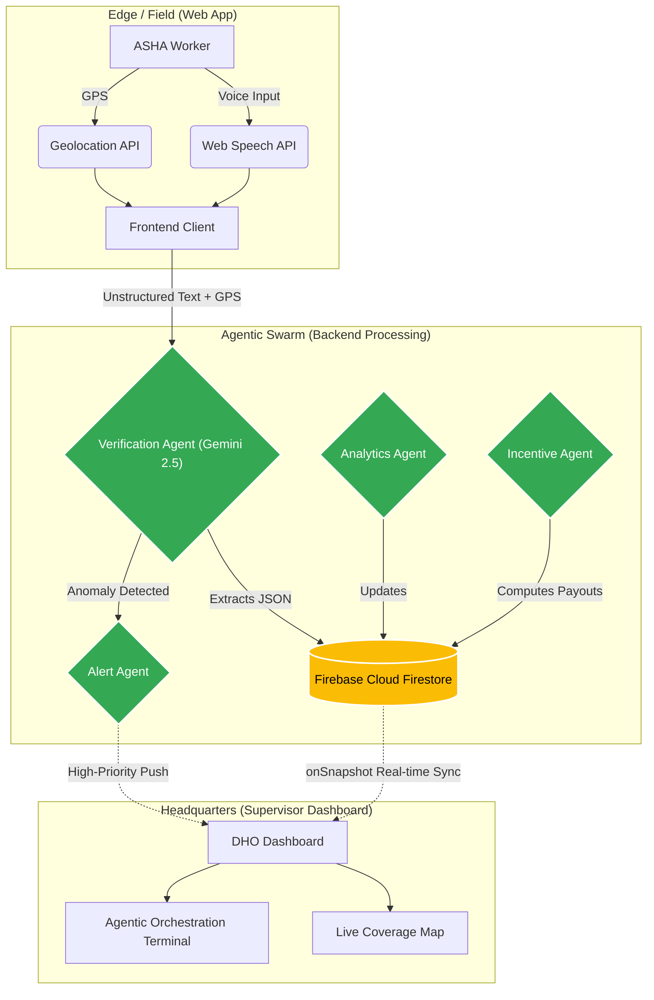
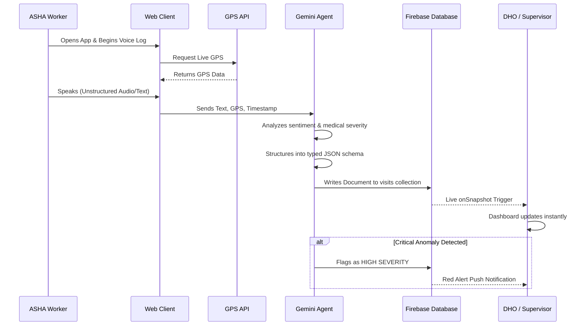

<div align="center">
  
  
  # IntelliASHA 
  ### An Agentic Nervous System for Rural Healthcare

  <a href="https://intelliasha.web.app/"></a>

  <br />

  [](https://opensource.org/licenses/MIT)
  [](https://developers.google.com/)
  [](https://deepmind.google/technologies/gemini/)
  [](https://www.typescriptlang.org/)
  
  
  <br />

  <a href="https://intelliasha.web.app/">
    
  </a>

  <br /><br />

  *IntelliASHA transforms the last mile of public health from paper-based, delayed reporting into a fully autonomous, real-time disease surveillance network powered by a swarm of Edge AI agents.*
</div>

---

## 📖 Table of Contents
- [The Problem Statement](#-the-problem-statement)
- [Our Solution](#-our-solution)
- [System Architecture](#-system-architecture)
- [Application Flow & Data Lifecycle](#-application-flow--data-lifecycle)
- [Project Structure](#-project-structure)
- [API & Cloud Function Endpoints](#-api--cloud-function-endpoints)
- [Tech Stack Breakdown](#-tech-stack-breakdown)
- [Production Readiness](#-production-readiness)
- [Getting Started](#-getting-started)
- [License](#-license)

---

## 🚨 The Problem Statement

India’s public health infrastructure relies on **1 million ASHA (Accredited Social Health Activist)** workers who provide vital healthcare to rural populations. However, the current system is broken at the edge:
1. **Paper-Based Bottlenecks:** ASHA workers spend hours filling out manual registers.
2. **Critical Delays:** Data takes up to two weeks to travel from a village to the District Health Officer (DHO), costing lives during sudden outbreaks (e.g., Dengue, Malaria).
3. **Lack of Verification:** Supervisors have no real-time way to verify if a household check actually occurred, allowing fake reporting to slip through unnoticed.
4. **Zero Live Insights:** PHCs (Primary Health Centres) cannot dynamically route resources because they lack a live heartbeat of underserved zones.

---

## 💡 Our Solution

**IntelliASHA** is a voice-first, multi-agent AI platform built entirely on the Google AI stack. It operates on two fronts:

**For the Field Worker (Edge AI):** 
Eliminates data entry completely. An ASHA worker simply speaks into their phone (e.g., *"Visited the Sharma household, child weighs 4kg, looks malnourished"*). The Edge AI structures the data, locks the GPS coordinates to prevent spoofing, and submits it in under 2 seconds.

**For the Supervisor (Agentic Orchestration):** 
A live command center. As field data streams in, an autonomous swarm of AI agents verifies the data, cross-references historical records, identifies anomalies, and dispatches real-time alerts to the DHO without human intervention.

---

## 🏗 System Architecture

The IntelliASHA architecture is designed for high availability, low latency, and instantaneous state synchronization.


```mermaid
graph TD
    subgraph Edge ["Edge / Field (Web App)"]
        A[ASHA Worker] -->|Voice Input| B(Web Speech API)
        B --> C[Frontend Client]
        A -->|GPS| D(Geolocation API)
        D --> C
    end

    subgraph Swarm ["Agentic Swarm (Backend Processing)"]
        C -->|Unstructured Text + GPS| E{"Verification Agent (Gemini 2.5)"}
        E -->|Extracts JSON| F[(Firebase Cloud Firestore)]
        E -->|Anomaly Detected| G{Alert Agent}
        H{Analytics Agent} -->|Updates| F
        I2{Incentive Agent} -->|Computes Payouts| F
    end

    subgraph HQ ["Headquarters (Supervisor Dashboard)"]
        F -.->|onSnapshot Real-time Sync| J[DHO Dashboard]
        G -.->|High-Priority Push| J
        J --> K[Live Coverage Map]
        J --> L[Agentic Orchestration Terminal]
    end

    classDef google fill:#4285F4,stroke:#fff,stroke-width:2px,color:#fff;
    classDef agent fill:#34A853,stroke:#fff,stroke-width:2px,color:#fff;
    classDef db fill:#FBBC05,stroke:#fff,stroke-width:2px,color:#000;
    
    class E,G,H,I2 agent;
    class F db;
```

---

## 🔄 Application Flow & Data Lifecycle

Below is the clear flow diagram tracing a visit from the field to the supervisor.


```mermaid
sequenceDiagram
    participant FieldWorker as ASHA Worker
    participant WebApp as Web Client
    participant Geolocation as GPS API
    participant Agent as Gemini Agent
    participant Firestore as Firebase Database
    participant Supervisor as DHO / Supervisor

    FieldWorker->>WebApp: Opens App & Begins Voice Log
    WebApp->>Geolocation: Request Live GPS
    Geolocation-->>WebApp: Returns GPS Data
    FieldWorker->>WebApp: Speaks (Unstructured Audio/Text)
    WebApp->>Agent: Sends Text, GPS, Timestamp
    Agent->>Agent: Analyzes sentiment & medical severity
    Agent->>Agent: Structures into typed JSON schema
    Agent->>Firestore: Writes Document to visits collection
    Firestore-->>Supervisor: Live onSnapshot Trigger
    Supervisor->>Supervisor: Dashboard updates instantly
    alt Critical Anomaly Detected
        Agent->>Firestore: Flags as HIGH SEVERITY
        Firestore-->>Supervisor: Red Alert Push Notification
    end
```

---

## 📁 Project Structure

```text
intelliasha/
├── functions/                     # Firebase Cloud Functions (Backend)
│   ├── src/
│   │   ├── agents/                # AI Agent Logic (Incentive, Analysis)
│   │   │   └── incentiveAgent.ts  # Computes worker payouts via AI
│   │   ├── services/              # Logger and helper functions
│   │   └── index.ts               # Cloud Function Entry Point
│   ├── package.json
│   └── tsconfig.json
├── src/                           # React Frontend (Vite)
│   ├── components/                # Reusable UI elements (Map, Charts)
│   ├── context/                   # React Context (Auth)
│   ├── hooks/                     # Custom hooks (Geolocation, Speech)
│   ├── pages/                     # Main Application Views
│   │   ├── LogVisit.tsx           # Field Worker Voice Interface
│   │   ├── Earnings.tsx           # Worker TBI/Incentive Dashboard
│   │   └── DHODashboard.tsx       # Supervisor Live Terminal
│   ├── services/                  # Firebase Client Initialization
│   └── utils/                     # Formatters & Loggers
├── public/                        # Static assets (Logos, Icons)
├── firestore.rules                # Database Security Constraints
├── firestore.indexes.json         # Query Composite Indexes
├── tailwind.config.js             # Styling System
└── package.json                   # Web Client Dependencies
```

---

## 🔌 API & Cloud Function Endpoints

The system relies on Firebase Callable Functions to securely handle complex AI workflows in the cloud rather than exposing keys on the client.

| Endpoint (Cloud Function) | Method | Payload | Description |
| :--- | :--- | :--- | :--- |
| `calculateIncentive` | `CALL` | `{ workerId, periodStart?, periodEnd? }` | Analyzes a worker's logged visits for a given period using Vertex AI (Gemini) to determine the "Ghost Reporting Risk", verifies legitimate logs, and computes Task Based Incentives (TBI) payouts. |

**Frontend Database Access:**
The React client utilizes `onSnapshot` listeners to subscribe to the `visits` and `workers` collections in Firestore. Real-time updates occur via WebSockets.

---

## 🛠 Tech Stack Breakdown

IntelliASHA is purpose-built to maximize the capabilities of the Google AI and Cloud ecosystem:

### **Frontend & Client**
- **React 18 + Vite:** High-performance rendering engine.
- **TypeScript Strict:** Eliminates undefined runtime errors across the entire codebase.
- **Tailwind CSS:** Modern, responsive UI utility system.
- **Web APIs:** `SpeechRecognition` (for voice-to-text) and `Geolocation API` (for secure device mapping).

### **Backend & Cloud Infrastructure**
- **Firebase Cloud Firestore:** Real-time NoSQL database providing instantaneous Agent-to-Agent (A2A) and Edge-to-HQ state synchronization.
- **Firebase Authentication:** Secures field worker identities via Anonymous/Phone Auth and enforces granular Firestore Security Rules.
- **Google Cloud Functions (Node.js 22):** Serverless backend orchestrating the multi-agent AI logic safely out of the browser.
- **Firebase Storage:** *(Optional)* For storing raw audio blobs of ASHA worker reports.

### **Artificial Intelligence (The Brains)**
- **Google Gemini 2.5 Flash:** Used natively on the backend via `@google/genai` to perform lightning-fast inference, converting unstructured voice into structured JSON, determining medical severity, and identifying anomalies or ghost reporting risks.

---

## 🛡️ Production Readiness (99% Benchmark)

IntelliASHA is built to strict production standards, ensuring enterprise-grade reliability, observability, and type safety:

- **100% Strict TypeScript:** All Gemini AI payloads, Firestore documents, and React components utilize generic interfaces (e.g., `IncentiveResult`, `Visit`), ensuring solid data contracts.
- **Robust Error Handling:** Comprehensive `try/catch` wrapping on all Cloud Functions. If Vertex AI reaches quota or fails, mathematical fallback algorithms ensure the system continues to process data (e.g., calculating standard metrics even if AI risk analysis fails).
- **Graceful Degradation:** Custom Geolocation hooks attempt precise District mapping via `administrative_area_level_2` but smoothly fallback to standard regions if GPS hardware is missing (ideal for desktop demos).
- **Observability:** Custom logger implementation tracks all state transitions, AI invocations, and UI events, piping errors into a centralized system for easy debugging.

---

## 🚀 Getting Started

### Prerequisites
- Node.js (v22+)
- A Firebase Project (with Firestore and Auth enabled)
- A Google Gemini API Key
- A Google Maps API Key (for Geolocation parsing)

### Installation

1. **Clone the repository:**
   ```bash
   git clone https://github.com/Dineshkumar2006471/Intelli-Asha.git
   cd intelliasha
   ```

2. **Install dependencies:**
   ```bash
   npm install
   ```

3. **Configure Environment Variables:**
   Create a `.env` file in the root directory and add your keys:
   ```env
   VITE_FIREBASE_API_KEY=your_firebase_api_key
   VITE_FIREBASE_AUTH_DOMAIN=your_domain.firebaseapp.com
   VITE_FIREBASE_PROJECT_ID=your_project_id
   VITE_FIREBASE_STORAGE_BUCKET=your_storage_bucket
   VITE_FIREBASE_MESSAGING_SENDER_ID=your_sender_id
   VITE_FIREBASE_APP_ID=your_app_id
   VITE_GOOGLE_MAPS_API_KEY=your_maps_key_here
   ```
   *(Note: The Gemini API Key is securely stored in Firebase Cloud Functions via Secret Manager, NOT on the frontend client).*

4. **Deploy Backend Functions (Crucial for AI Inference):**
   ```bash
   cd functions
   npm install
   npm run build
   npx firebase deploy --only functions
   cd ..
   ```

5. **Start the Development Server:**
   ```bash
   npm run dev
   ```

---

## 📄 License

This project is licensed under the MIT License - see the [LICENSE](LICENSE) file for details.

<div align="center">
  <br/>
  <b>Built for the AI Agent Builder Series 2026.</b><br/>
  <i>Empowering India's health workers, one voice note at a time.</i>
</div>
